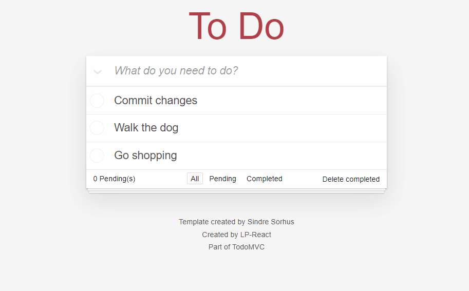

# [To Do - App](https://lp-react.github.io/ToDo-App/)

  

## 📖 Resumen 📖

**To Do** is a task management application designed for efficient organization. The application allows you to:
- #### Create and manage task lists.
- #### Track completion status.
- #### Easily remove tasks as needed.
\
**To Do** simplifies task management, making it an ideal solution for various purposes. Explore the application today to enhance your organizational workflow.

## 💻 Technologies used 💻

|Technology |Version |Function|
|---------- |:------:|-------|
|HTML       |5       |Web page structure.|
|CSS        |3       |Cascading styles for each HTML element.|
|JavaScript |3       |Programming language for adding interactivity to the web page.|
|[Webpack](https://webpack.js.org)|5|Module bundler for JavaScript, CSS, and other assets, bundles them together in a way that's optimized for the web.|
|[Babel](https://babeljs.io)|4.7|JavaScript compiler that enables the use of new JavaScript features in non-compatible browsers.|
|[NodeJS](https://nodejs.org/en)|20.10|Allows run JavaScript on the server side, enabling server-side scripting and building scalable network applications.|

### 🔗 Connect with me 🔗
---

